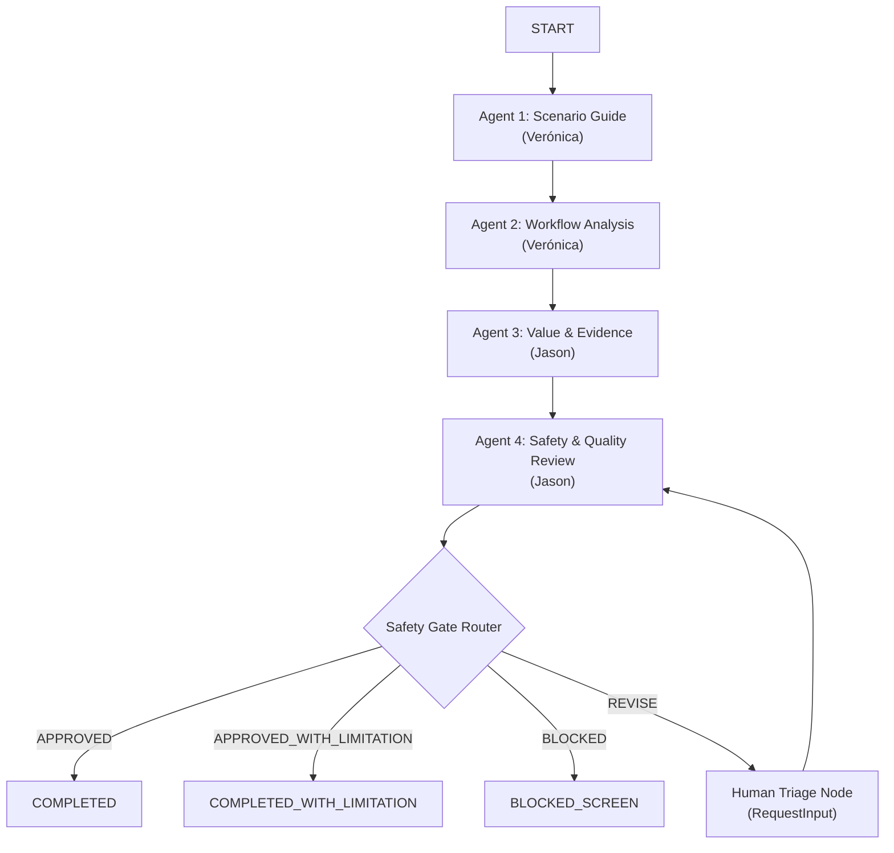

# Architecture Design

## Core Application Structure
The `core-lab/` directory is the single active, runnable wAI Scenario Lab application. Duplicate root-level structures (such as `app/`, `docs/`, `mcp_server/`, `tests/`) from Verónica's Day 1 manual draft are kept as historical reference and are not merged directly to prevent namespace collisions and build system pollution.

## Design Highlights

### 1. Config-Driven Scenarios
The application behavior, user interface metadata, question definitions, input validation messages, and scenario-specific parameters are fully defined in [wai_scenario_config.json](file:///c:/Users/MissV/Documents/Google/wai-scenario-lab/wai-scenario-lab/core-lab/wai_scenario_config.json). This allows adding or updating podcast scenarios without modifying the agent implementation or orchestration logic.

### 2. Four-Agent Flow
Orchestrated using the Google Agent Development Kit (ADK) 2.0 graph workflow, the system routes the user's answers sequentially through four specialized agents:

*   **Agent 1 (Scenario Guide)**: Sanitizes input, redacts PII, and structures raw answers.
*   **Agent 2 (Workflow Analyst)**: Identifies a single cautious process friction and proposes exactly one manual next step.
*   **Agent 3 (Value & Evidence)**: Connects to external calculator tools to derive baselines and measurement guidance.
*   **Agent 4 (Safety & Quality Review)**: Runs safety gates on output structure, compliance limits, and professional advice boundaries.

### 3. Deterministic Safety Gate
To ensure high-risk or low-quality content never reaches the user, a deterministic routing function `evaluate_safety_gate` parses the Pydantic payload of Agent 4. It routes the execution graph to:
*   **APPROVED**: Renders the complete Scenario Brief.
*   **APPROVED_WITH_LIMITATION**: Renders the brief with a caution banner.
*   **BLOCKED**: Terminates execution immediately.
*   **REVISE**: Routes to a human-in-the-loop triage node (`RequestInput`) for manual correction, avoiding non-deterministic LLM loop errors.

### 4. Role of MCP Servers
Model Context Protocol (MCP) servers (e.g., `roi_calculator_server.py`) expose deterministic python calculation tools to Agent 3. This decouples arithmetic from the LLM, preventing hallucinated calculations while keeping the core agent logic clean and focused.
