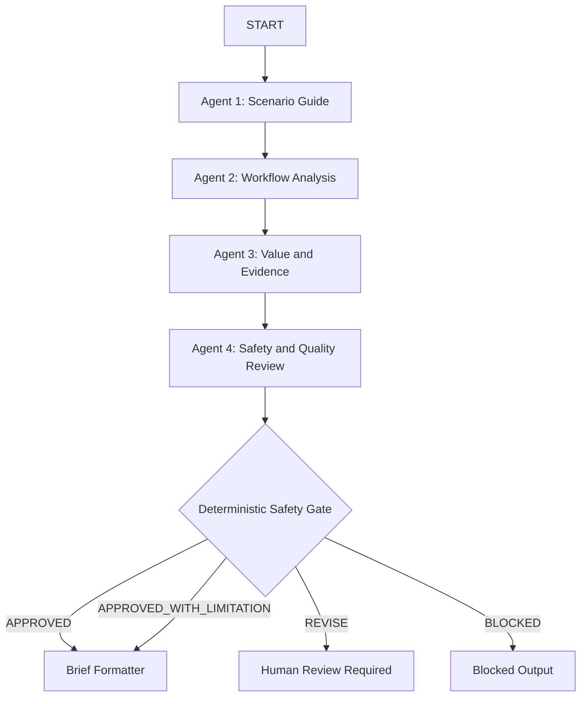

# Architecture Design

The `core-lab/` directory is the active runnable wAI Scenario Lab application. Older sprint and recovery documents remain as historical evidence, but the final architecture source is this file plus `docs/architecture/agent-graph.md`.

## Core Design

### Config-Driven Scenarios

Scenario behavior, UI metadata, question definitions, validation messages, measurements, podcast references, and scenario-specific guardrails are defined in `core-lab/wai_scenario_config.json`. The UI, API validation, deterministic workflow adapter, and MCP server all read from this shared source.

### Four-Agent Flow

- **Scenario Guide** structures raw answers, identifies missing information, and strips obvious sensitive data.
- **Workflow Analysis** identifies one likely friction point and proposes exactly one low-risk manual action.
- **Value and Evidence** selects one configured non-financial measurement and labels evidence strength.
- **Safety and Quality Review** checks privacy, high-risk domains, unsupported claims, one-action restraint, and required disclosures.

### ADK Graph And Local Adapter

`core-lab/app/workflow.py` includes an ADK-style graph workflow definition. Because live ADK/Gemini execution requires credentials and project configuration, the same file also contains deterministic local nodes used by tests and the local demo. This avoids pretending live cloud execution occurred while preserving the intended graph architecture.

### MCP Server

`core-lab/mcp_server/scenario_config_server.py` is the active MVP MCP server. It exposes scenario IDs, titles, descriptions, questions, measurements, and metadata from the scenario configuration. It does not calculate ROI, fetch private data, or require external network access during tests.

### Deterministic Safety Gate

`core-lab/app/services/safety.py` checks for PII-like patterns, high-risk domains, prohibited automation requests, unsupported ROI/savings claims, and absolute certainty language. `core-lab/app/services/brief_assembler.py` withholds completed brief details for revision-required or blocked paths.

### Final Architecture Reference

See `core-lab/docs/architecture/agent-graph.md` for graph nodes, transitions, status mapping, human-review gate, and deterministic routing details.
