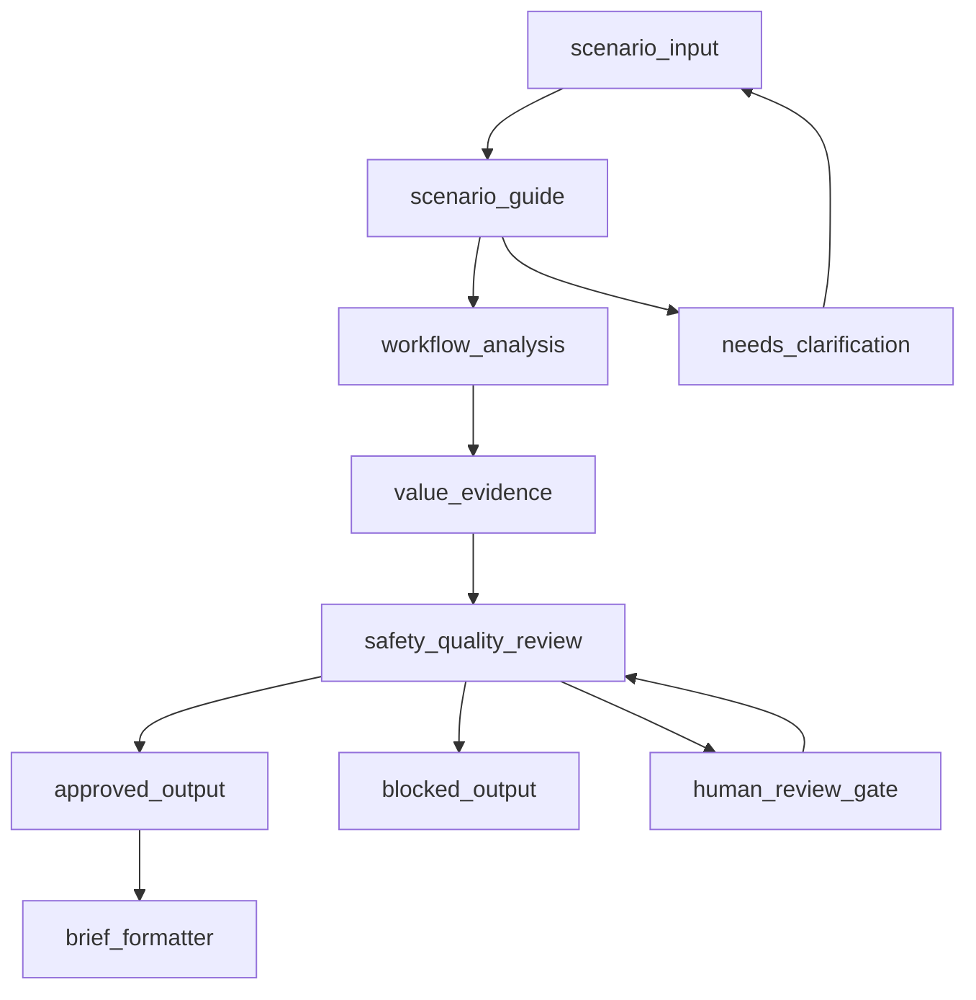

# Agent Graph Architecture

The active implementation is in `core-lab/app/workflow.py`. It contains two layers:

1. An ADK-style multi-agent graph definition for the capstone architecture.
2. A deterministic local adapter that mirrors the graph for offline tests and demos when live Gemini credentials are unavailable.

## Nodes

| Node | Responsibility | Evidence |
| --- | --- | --- |
| `scenario_input` | Receives selected scenario ID and answer payload. | `fast_api_app.py`, `form_validation.py` |
| `scenario_guide` | Structures answers and identifies missing or sensitive details. | `workflow.py`, `scenario-guide` skill |
| `workflow_analysis` | Identifies one friction point and one low-risk next action. | `workflow.py`, `workflow-analyst` skill |
| `value_evidence` | Selects one configured non-financial measurement. | `workflow.py`, `scenario_config_server.py`, `value-evidence-reviewer` skill |
| `safety_quality_review` | Checks privacy, high-risk domains, claims, scope, and disclosures. | `workflow.py`, `services/safety.py`, `safety-reviewer` skill |
| `brief_formatter` | Builds the Scenario Brief only for approved statuses. | `services/brief_assembler.py`, `brief-formatter` skill |
| `human_review_gate` | Routes revisions or unclear cases to human review. | `workflow.py`, `safety_router.py` |
| `approved_output` | Returns the completed Scenario Brief. | `brief_assembler.py` |
| `blocked_output` | Withholds brief details for high-risk or out-of-scope requests. | `brief_assembler.py` |
| `needs_clarification` | Represents missing or incomplete answer handling. | `form_validation.py`, `workflow.py` |

## Transitions

## Deterministic Routing Logic

The local adapter and safety router handle these routes without relying only on model instructions:

- Missing or invalid answers: validation returns field errors before analysis.
- Incomplete or vague answers: fallback measurement or limitation path is used.
- Sensitive or personal data: `REVISE` is returned and brief sections are withheld.
- High-risk domains: `BLOCKED` is returned and brief sections are withheld.
- Unsupported ROI or savings claims: `REVISE` is returned.
- Requests for more than one action: schema and safety-review instructions enforce one action.
- Out-of-scope automation: `BLOCKED` is returned for requests to send, publish, purchase, submit, connect accounts, or perform similar actions.

## Status Mapping

The code currently preserves earlier internal status names for test stability:

| Final-facing meaning | Internal status |
| --- | --- |
| Approved output | `APPROVED` |
| Needs clarification / incomplete evidence | `APPROVED_WITH_LIMITATION` or validation error |
| Human review required | `REVISE` |
| Blocked output | `BLOCKED` |

Docs and demo language should explain the final-facing meaning while showing the actual internal payload values if the UI or API is visible.

## Human Review Gate

The Scenario Brief includes a mandatory human-review reminder. The graph also defines a `RequestInput`-style human triage node for revision cases. Local deterministic execution withholds unsafe or revision-required brief details rather than pretending the live human-in-the-loop service ran.

## MCP Boundary

Agent 3 uses the MCP scenario configuration server as the source for scenario IDs, questions, measurements, podcast metadata, and safety boundaries. The MCP server exposes configuration only; it does not calculate ROI, connect to accounts, or fetch private data.
