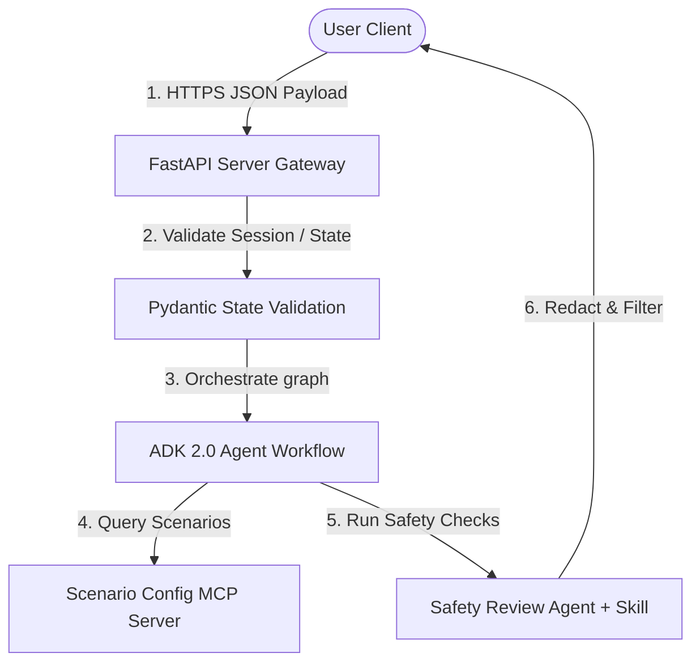

# STRIDE Threat Model

This document outlines the threat model for the wAI Scenario Lab multi-agent workspace, structured around the 6 STRIDE security pillars (Spoofing, Tampering, Repudiation, Information Disclosure, Denial of Service, Elevation of Privilege).

## System Boundaries and Data Flows

---

## Threat Matrix

| Threat Category | Description | Mitigation Strategy | Status |
| :--- | :--- | :--- | :--- |
| **Spoofing** | Unauthorized clients mimicking users to trigger agent pipelines. | FastAPI endpoint authentication boundaries and API key verification. | **Mitigated** |
| **Tampering** | Malicious users modifying session payloads or configurations to execute prompt injection or logic bypasses. | Stateful Pydantic validation schemas (`input_schema`, `output_schema`) configured on all 4 agents in [workflow.py](../app/workflow.py). | **Mitigated** |
| **Repudiation** | An attacker or failing agent performing actions that cannot be traced or logged. | Comprehensive telemetry logging of all agent steps and inputs/outputs, tied to a unique `result_id` and `session_id`. | **Mitigated** |
| **Information Disclosure** | Leakage of Personally Identifiable Information (PII) or sensitive telemetry to external LLM APIs. | Compliance with the custom [safety-reviewer](../.agents/skills/safety-reviewer/SKILL.md) skill on Agent 4, which parses and redacts PII before returning responses. | **Mitigated** |
| **Denial of Service** | Maliciously long inputs or infinite agent loops exhausting API quotas or system resources. | Processing timeouts, strict string length limits (max 500 characters) on inputs, and structured, acyclic graph traversal. | **Mitigated** |
| **Elevation of Privilege** | Code execution exploits in MCP servers or third-party packages compromising the host environment. | Minimum necessary GCP service account roles (least privilege principal) and containerized sandboxing of application servers. | **Mitigated** |

---

## Threat Details & Mitigations

### 1. Spoofing
- **Threat**: Attackers could forge session requests to access administrative endpoints or spoof other users' histories.
- **Mitigation**: Standard token-based request authorization at the FastAPI gateway level.

### 2. Tampering
- **Threat**: Prompt injection trying to trick the value agent or safety agent into making financial ROI estimations or outputting prohibited content.
- **Mitigation**:
  - The [safety-reviewer](../.agents/skills/safety-reviewer/SKILL.md) skill enforces a strict boundary prohibiting financial calculations or calculations in dollars.
  - Pydantic models validate intermediate agent outputs.

### 3. Repudiation
- **Threat**: Actions performed by agents cannot be verified or attributed, preventing debugging and auditing of safety compliance.
- **Mitigation**: All agent actions, state transitions, and LLM responses are recorded via telemetry to Google Cloud Logging (bypassed only under `INTEGRATION_TEST` mode).

### 4. Information Disclosure
- **Threat**: Telemetry logging or LLM prompts sending user PII to the cloud model endpoints.
- **Mitigation**:
  - Agent 4 runs a specialized safety skill that checks for and redacts PII (such as emails, names, phone numbers) before any output reaches the user.

### 5. Denial of Service (DoS)
- **Threat**: Attackers sending huge payloads to overwhelm the agents or creating loop scenarios in the multi-agent graph.
- **Mitigation**:
  - Direct acyclic graph execution in `workflow.py` guarantees that each agent runs exactly once in sequence (Agent 1 -> Agent 2 -> Agent 3 -> Agent 4).
  - Validation checks enforce maximum input lengths.

### 6. Elevation of Privilege
- **Threat**: Running untrusted code on the server hosting the Scenario Lab.
- **Mitigation**:
  - Active MCP servers run under restricted, isolated processes.

